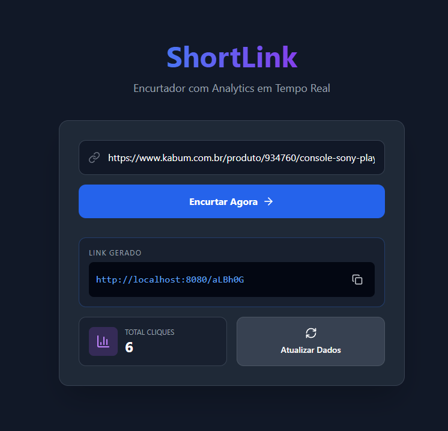

# 🚀 ShortLink - High Performance URL Shortener

Sistema de encurtamento de URLs Full Stack focado em performance e escalabilidade. Desenvolvido para lidar com alto tráfego utilizando cache distribuído e processamento assíncrono.


## 🛠️ Tech Stack

**Backend:**

- Java 17 + Spring Boot 3
- **PostgreSQL:** Persistência de dados relacionais.
- **Redis:** Cache de leitura (Hit ratio > 90%) para redirecionamento em baixa latência.
- **Spring Async:** Processamento de logs de analytics em segundo plano (non-blocking).
- **Docker:** Containerização da infraestrutura.

**Frontend:**

- React + Vite
- Tailwind CSS
- Axios + Lucide Icons
- Chart/Analytics Dashboard

## 🏗️ Arquitetura

O sistema utiliza uma estratégia de **Write-Behind** para analytics e **Read-Through** para redirecionamento:

1.  **Encurtamento:** Gera hash único (Base62) e salva no Postgres + Redis.
2.  **Redirecionamento:**
    - Consulta o Redis (Cache). Se existir, redireciona imediatamente (~10ms).
    - Se não, busca no DB, atualiza o Cache e redireciona.
3.  **Analytics:** O clique é contabilizado de forma assíncrona (`@Async`) para não impactar a experiência do usuário.

## 🐳 Como Rodar (Docker)

Pré-requisitos: Docker e Docker Compose instalados.

1.  Clone o repositório:

    ```bash
    git clone [https://github.com/SEU-USUARIO/shortlink.git](https://github.com/SEU-USUARIO/shortlink.git)
    cd shortlink
    ```

2.  Suba a infraestrutura e o projeto:

    ```bash
    docker-compose up -d
    ```

3.  Acesse:
    - **Frontend:** http://localhost:5173
    - **Backend API:** http://localhost:8080

## 📸 Screenshots

### 🏠 Tela Inicial

Interface limpa e direta para encurtamento rápido.


### 🖥️ Dashboard de Analytics

Visualização em tempo real dos cliques e performance dos links.


## 📄 Licença

Este projeto está sob a licença MIT.
